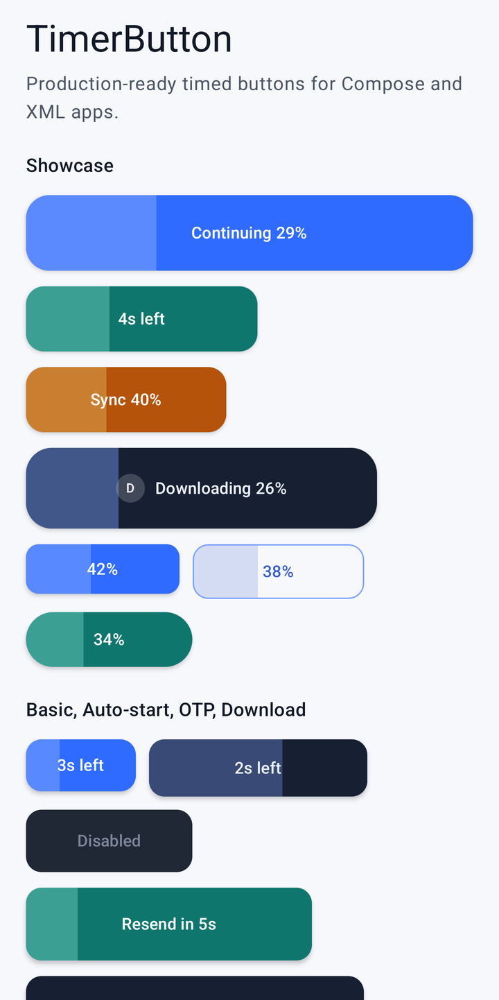
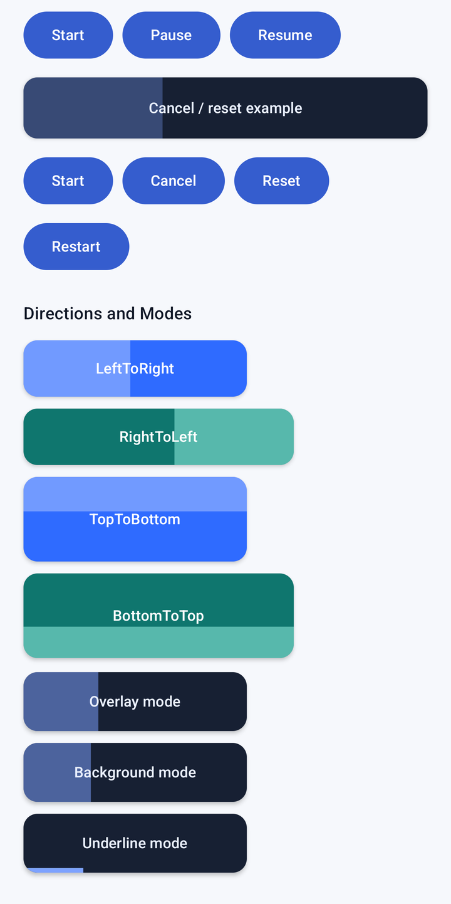
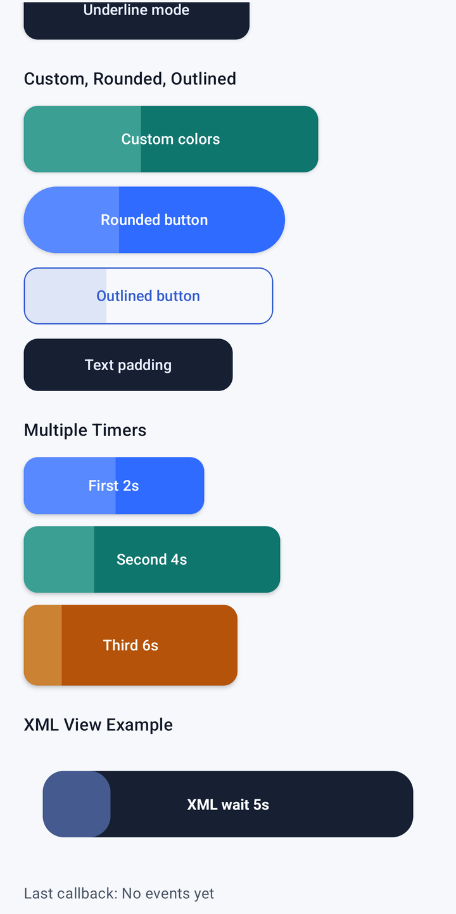

# TimerButton

[](https://central.sonatype.com/artifact/com.goeslocal/timerbutton)
[](LICENSE)
[](https://developer.android.com/)

TimerButton is an Android library for Material-style buttons with elapsed-time progress. Use it for resend OTP cooldowns, retry waits, download or sync progress, hold-to-continue flows, and any UI where a button owns a short countdown.

It supports both Android UI stacks:

- Jetpack Compose: `TimerButton(...)` and `rememberTimerButtonState(...)`
- XML/View apps: `TimerButtonView`

The reusable implementation lives in `:timerbutton`. The `:app` module is a runnable demo for both Compose and XML.

## Demo

Screenshots captured from the sample app on a physical Android device. The visible timers are running and the device bars are cropped out.

<table>
  <tr>
    <td></td>
    <td></td>
    <td></td>
  </tr>
  <tr>
    <td>Compose Showcase</td>
    <td>Directions and Modes</td>
    <td>Multiple Timers and XML</td>
  </tr>
</table>

## Install

From Maven Central:

```kotlin
dependencies {
    implementation("com.goeslocal:timerbutton:0.1.0")
}
```

For local development in this repo:

```kotlin
dependencies {
    implementation(project(":timerbutton"))
}
```

## Compose Quick Start

This starts automatically when the user taps the button:

```kotlin
import androidx.compose.foundation.layout.height
import androidx.compose.foundation.layout.width
import androidx.compose.runtime.Composable
import androidx.compose.ui.Modifier
import androidx.compose.ui.unit.dp
import com.goeslocal.timerbutton.TimerButton

@Composable
fun RetryButton() {
    TimerButton(
        text = "Retry",
        durationMillis = 10_000L,
        modifier = Modifier
            .width(180.dp)
            .height(52.dp),
        onTimerComplete = {
            println("Retry is available again")
        },
    )
}
```

Use `textFormatter` when the label should describe the running state:

```kotlin
TimerButton(
    text = "Resend OTP",
    durationMillis = 30_000L,
    textFormatter = { state, label ->
        if (state.isRunning) {
            "Resend in ${(state.remainingMillis + 999) / 1000}s"
        } else {
            label
        }
    },
)
```

## Compose Controlled Timer

Use `rememberTimerButtonState` when another control or business event starts, pauses, resumes, cancels, resets, or restarts the timer.

```kotlin
import androidx.compose.foundation.layout.Column
import androidx.compose.material3.Button
import androidx.compose.material3.Text
import androidx.compose.runtime.Composable
import com.goeslocal.timerbutton.TimerButton
import com.goeslocal.timerbutton.TimerButtonConfig
import com.goeslocal.timerbutton.rememberTimerButtonState

@Composable
fun ManualOtpCooldown() {
    val timerState = rememberTimerButtonState(durationMillis = 30_000L)

    Column {
        TimerButton(
            state = timerState,
            text = "Resend OTP",
            config = TimerButtonConfig(
                durationMillis = 30_000L,
                clickStartsTimer = false,
            ),
            textFormatter = { state, label ->
                if (state.isRunning || state.isPaused) {
                    "Resend in ${(state.remainingMillis + 999) / 1000}s"
                } else {
                    label
                }
            },
        )

        Button(onClick = { timerState.start() }) { Text("Start") }
        Button(onClick = { timerState.pause() }) { Text("Pause") }
        Button(onClick = { timerState.resume() }) { Text("Resume") }
        Button(onClick = { timerState.cancel() }) { Text("Cancel") }
        Button(onClick = { timerState.reset() }) { Text("Reset") }
        Button(onClick = { timerState.restart() }) { Text("Restart") }
    }
}
```

## Compose Customization

```kotlin
import androidx.compose.foundation.BorderStroke
import androidx.compose.foundation.layout.PaddingValues
import androidx.compose.foundation.layout.height
import androidx.compose.foundation.layout.width
import androidx.compose.foundation.shape.RoundedCornerShape
import androidx.compose.material3.Text
import androidx.compose.ui.Modifier
import androidx.compose.ui.graphics.Color
import androidx.compose.ui.unit.dp
import com.goeslocal.timerbutton.TimerButton
import com.goeslocal.timerbutton.TimerButtonColors
import com.goeslocal.timerbutton.TimerButtonConfig
import com.goeslocal.timerbutton.TimerProgressDirection
import com.goeslocal.timerbutton.TimerProgressMode

TimerButton(
    text = "Download report",
    durationMillis = 8_000L,
    modifier = Modifier
        .width(240.dp)
        .height(56.dp),
    config = TimerButtonConfig(
        durationMillis = 8_000L,
        progressDirection = TimerProgressDirection.LeftToRight,
        progressMode = TimerProgressMode.Overlay,
    ),
    colors = TimerButtonColors(
        containerColor = Color(0xFF172033),
        contentColor = Color.White,
        progressColor = Color(0xFF7DA2FF),
        disabledContainerColor = Color(0xFFE5E7EB),
        disabledContentColor = Color(0xFF6B7280),
    ),
    shape = RoundedCornerShape(18.dp),
    border = BorderStroke(1.dp, Color(0xFF7DA2FF)),
    progressAlpha = 0.42f,
    contentPadding = PaddingValues(horizontal = 24.dp, vertical = 10.dp),
    leadingIcon = {
        Text("D")
    },
)
```

## XML Quick Start

Add the namespace and place `TimerButtonView` in a normal XML layout:

```xml
<LinearLayout
    xmlns:android="http://schemas.android.com/apk/res/android"
    xmlns:app="http://schemas.android.com/apk/res-auto"
    android:layout_width="match_parent"
    android:layout_height="wrap_content"
    android:orientation="vertical">

    <com.goeslocal.timerbutton.TimerButtonView
        android:id="@+id/resendButton"
        android:layout_width="220dp"
        android:layout_height="56dp"
        android:text="Resend OTP"
        android:textStyle="bold"
        app:timerDuration="30000"
        app:timerTextIdle="Resend OTP"
        app:timerTextRunning="Resend in %ss"
        app:timerTextCompleted="Resend now"
        app:timerButtonBackgroundColor="#172033"
        app:timerTextColor="#FFFFFF"
        app:timerProgressColor="#7DA2FF"
        app:timerProgressAlpha="0.45"
        app:timerProgressDirection="leftToRight"
        app:timerProgressMode="overlay"
        app:timerCornerRadius="18dp"
        app:timerAutoStart="false"
        app:timerClickStartsTimer="true"
        app:timerAllowClickWhileRunning="false" />
</LinearLayout>
```

Wire lifecycle callbacks and manual controls from Kotlin:

```kotlin
import android.os.Bundle
import android.widget.Toast
import androidx.activity.ComponentActivity
import com.goeslocal.timerbutton.TimerButtonListener
import com.goeslocal.timerbutton.TimerButtonStatus

class OtpActivity : ComponentActivity() {
    private lateinit var binding: OtpBinding

    override fun onCreate(savedInstanceState: Bundle?) {
        super.onCreate(savedInstanceState)
        binding = OtpBinding.inflate(layoutInflater)
        setContentView(binding.root)

        binding.resendButton.setTimerListener(
            object : TimerButtonListener {
                override fun onTimerStart() {
                    println("Cooldown started")
                }

                override fun onTick(remainingMillis: Long, progress: Float) {
                    println("remaining=$remainingMillis progress=$progress")
                }

                override fun onTimerComplete() {
                    Toast.makeText(this@OtpActivity, "Resend available", Toast.LENGTH_SHORT).show()
                }

                override fun onStateChange(status: TimerButtonStatus) {
                    println("Timer state=$status")
                }
            },
        )

        binding.startButton.setOnClickListener { binding.resendButton.start() }
        binding.pauseButton.setOnClickListener { binding.resendButton.pause() }
        binding.resumeButton.setOnClickListener { binding.resendButton.resume() }
        binding.cancelButton.setOnClickListener { binding.resendButton.cancel() }
        binding.resetButton.setOnClickListener { binding.resendButton.reset() }
        binding.restartButton.setOnClickListener { binding.resendButton.restart() }
    }

    override fun onDestroy() {
        binding.resendButton.release()
        super.onDestroy()
    }
}
```

## Common Features

Timer controls:

- `start()`: start from zero when idle or cancelled.
- `pause()`: pause a running timer.
- `resume()`: resume a paused timer.
- `cancel()`: stop at the current progress and show idle text.
- `reset()`: return to idle and zero progress.
- `restart()`: start again from zero.

Timer states:

- `Idle`
- `Running`
- `Paused`
- `Completed`
- `Cancelled`

Progress directions:

- Compose: `TimerProgressDirection.LeftToRight`, `RightToLeft`, `TopToBottom`, `BottomToTop`
- XML: `leftToRight`, `rightToLeft`, `topToBottom`, `bottomToTop`

Progress modes:

- Compose: `TimerProgressMode.Overlay`, `Background`, `Underline`
- XML: `overlay`, `background`, `underline`

## More Documentation

The README is the fast path. More detail lives here:

- [Usage Guide](docs/implementation-guide.md): Compose, XML, callbacks, lifecycle, testing, and production guidance.
- [Roadmap](ROADMAP.md): upcoming work and non-goals.
- [Contributing](CONTRIBUTING.md): local checks and release process.
- [Wiki Pages](docs/wiki/README.md): advanced recipes, architecture notes, and media capture.
- [Release Guide](docs/release.md): Maven Central setup for maintainers.

## Upcoming

Planned improvements include Compose previews for recipes, duration formatting helpers, runtime styling setters for `TimerButtonView`, expanded UI tests, and Dokka-generated API docs. See [Roadmap](ROADMAP.md).

## Production Guidance

TimerButton is a UI component. For important rules such as OTP cooldowns, billing windows, auth lockouts, or server-enforced retry limits, store the authoritative timestamp in your ViewModel, repository, or backend. Use TimerButton to render the visible countdown.

Compose state is saved across recomposition and normal Activity recreation. It is not a substitute for process-death persistence or server policy.

`TimerButtonView` clears animation callbacks when detached. If a Fragment binding or listener may outlive the view, call `release()` in `onDestroyView`.

## Development

Run tests and checks:

```bash
./gradlew check
```

Publish a release:

```bash
./gradlew publishAndReleaseToMavenCentral
```

See [Release Guide](docs/release.md) for Maven Central setup, signing, and GitHub Actions publishing.

Regenerate README screenshots from a connected Android device:

```bash
python3 scripts/capture_readme_media.py
```

If your system Python does not have Pillow, use the bundled Codex runtime Python or install Pillow in your local environment.

## License

Apache License 2.0. See [LICENSE](LICENSE).
