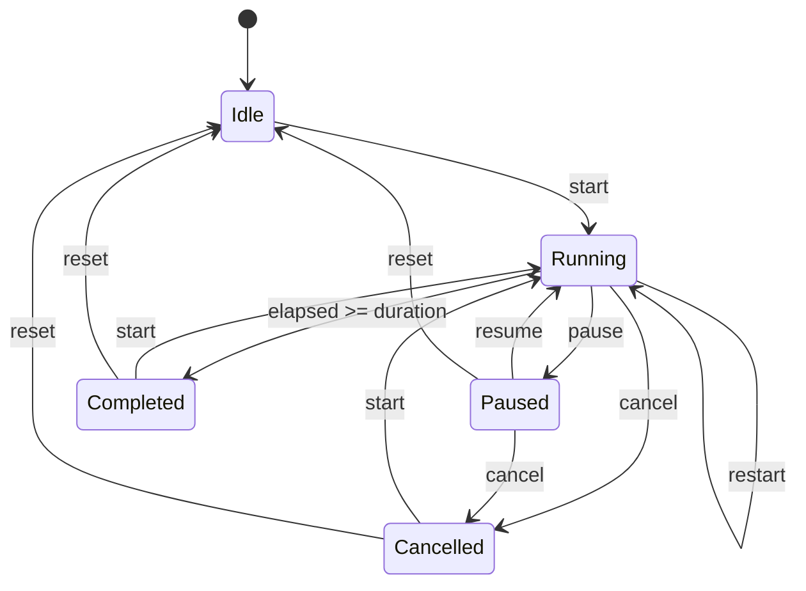

# Architecture Notes

TimerButton is intentionally small:

- `TimerButtonEngine` is a fake-clock-tested state machine in `timerbutton-core`.
- Compose and XML surfaces share the same state transitions.
- Progress is calculated from elapsed real time, not by subtracting fixed tick intervals.
- Public API stays focused on UI behavior: state, callbacks, styling, and progress rendering.

## State Flow

## Why There Is A Core Artifact

The engine exists to keep behavior testable and shared between Compose and XML without duplicating classes across artifacts. Public consumers should use `TimerButtonState` or `TimerButtonView`; `timerbutton-core` is published so `timerbutton-compose` and `timerbutton-view` can share the same timer state model safely.

## Versioning

TimerButton follows semantic versioning after `0.1.0`:

- Patch: bug fixes and documentation improvements.
- Minor: additive API and new visual options.
- Major: breaking public API changes.
