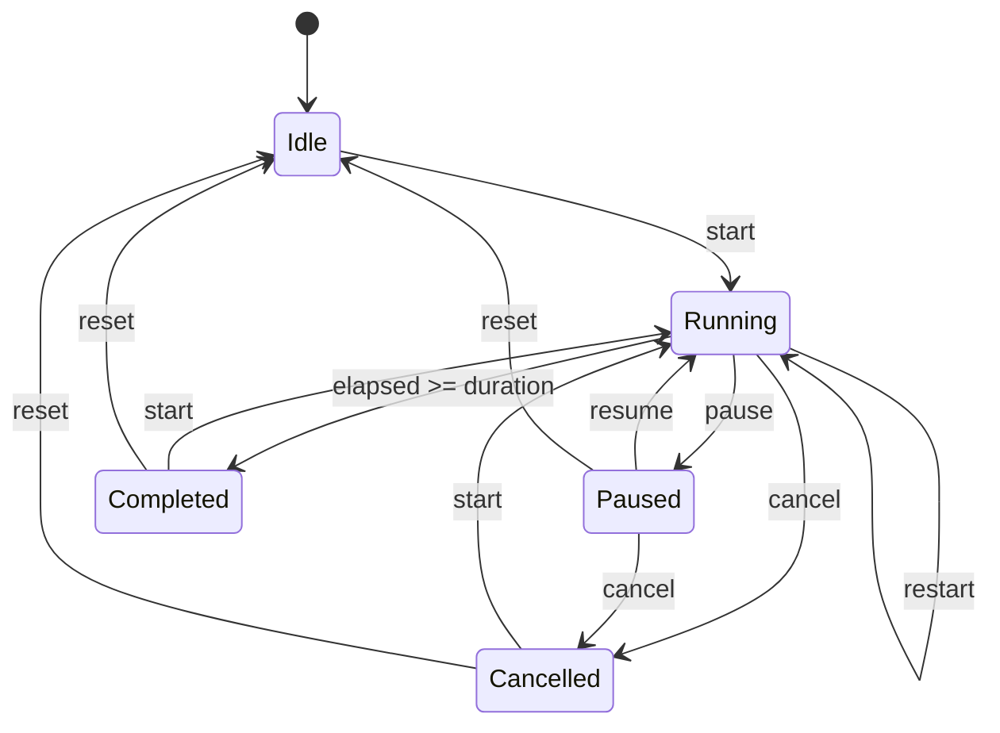

# Architecture Notes

TimerButton is intentionally small:

- `TimerButtonEngine` is an internal, fake-clock-tested state machine.
- Compose and XML surfaces share the same state transitions.
- Progress is calculated from elapsed real time, not by subtracting fixed tick intervals.
- Public API stays focused on UI behavior: state, callbacks, styling, and progress rendering.

## State Flow

## Why The Engine Is Internal

The engine exists to keep behavior testable and shared between Compose and XML. It is not part of the supported public API. Public consumers should use `TimerButtonState` or `TimerButtonView`.

## Versioning

TimerButton follows semantic versioning after `0.1.0`:

- Patch: bug fixes and documentation improvements.
- Minor: additive API and new visual options.
- Major: breaking public API changes.
